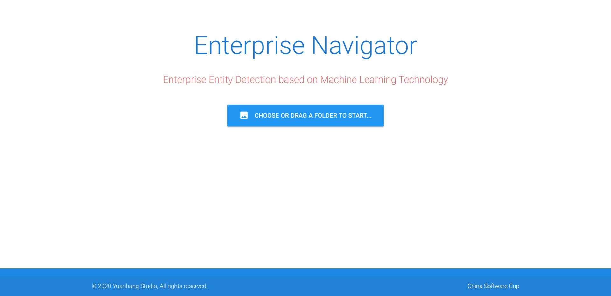

# Enterprise Navigator




[English](./README.md)

[简体中文](./docs/README_zh-cn.md)

A shopsign dectection application based on AdvancedEAST and AttentionOCR

- This was one of the projects during the "9th China Software Cup" (Second Part) competition.
- Our team won the National First Prize in this competition.

## Feature

- Target detection. Specifically, shopsign detection
  - During the competiton, we used the dataset included to train our models.
- Text recognition
- Dectection evaluation
- Results showcase
- Interative web UI

## Dependency

```
python>=3.7
tensorflow==1.14.0
tensorflow-gpu==1.14.0
tensorpack==0.9.8
keras==2.1.4
pycocotools
gast==0.2.2
```

## How to run

### Install requirements

- Make sure you already have a system with Nvidia graphics that support CUDA.
- [Anaconda](https://www.anaconda.com/) is highly recommended.

```
pip install -r requirements.txt
```

### Install models

- By default, if you haven't put any model inside `models` directory, it will automatically download our trained ones from [huggingface](https://huggingface.co/)
- You can put your own models into `models` folder.
  - Put AdvancedEAST models into `models/AdvancedEAST`
  - Put AttentionOCR models into `models/AttentionOCR`

### Launch

```
python launch.py
```

- Then you can visit the app using a web browser like `Google Chrome`.

```
http://localhost:6660
```

### License

MIT License

### References

[China Software Cup](http://www.cnsoftbei.com/)

[AdvancedEAST](https://github.com/huoyijie/AdvancedEAST)

[AttentionOCR](https://github.com/zhang0jhon/AttentionOCR)
