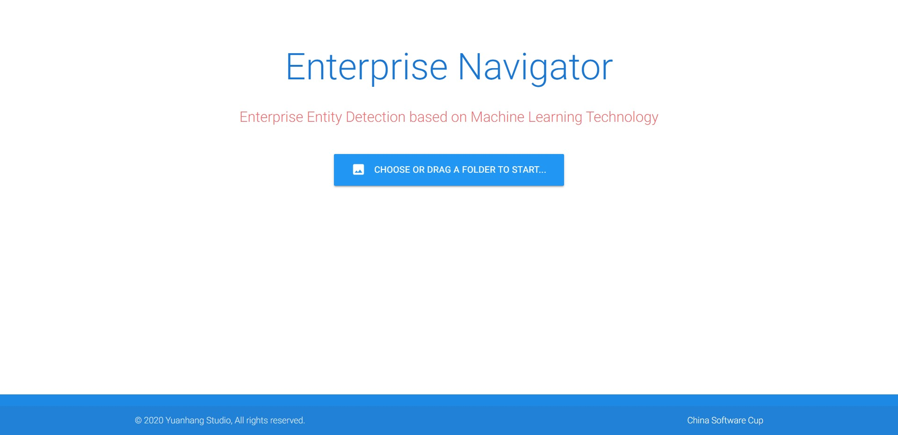
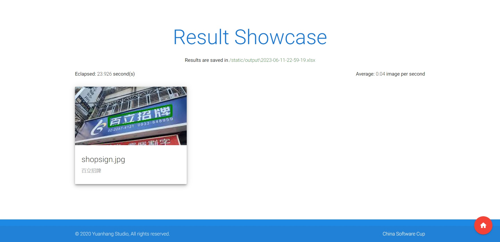

# Enterprise Navigator




[English](../README.md)

[简体中文](./README_zh-cn.md)

一个基于 AdvancedEAST 和 AttentionOCR 机器学习算法的企业实体招牌识别应用

- 这是第九届中国软件杯大学生软件设计大赛（第二批赛题）的其中一个参赛作品项目。
- 我们队伍在这次比赛中获得了全国一等奖。

## 功能特性

- 目标检测，具体来说是识别企业实体的招牌。
  - 我们使用了主办方提供的数据集来训练我们的算法模型。
- 文字识别
- 识别评估
- 结果展示
- 可交互的 UI 界面

## 依赖库

```
python>=3.7
tensorflow==1.14.0
tensorflow-gpu==1.14.0
tensorpack==0.9.8
keras==2.1.4
pycocotools
gast==0.2.2
```

## 如何运行

### 安装依赖库

- 确保你的运行机器有一个支持 CUDA 计算的 Nvidia 显卡。
- 推荐使用 [Anaconda](https://www.anaconda.com/)。

```
pip install -r requirements.txt
```

### 安装模型

- 默认情况下如果你还没有在 `models` 目录里安装模型的话将从 [huggingface](https://huggingface.co/) 自动下载我们训练好的。
- 你可以将你自己训练的模型放入到 `models` 文件夹里
  - 把 AdvancedEAST 模型放入到 `models/AdvancedEAST` 文件夹中。
  - 把 AttentionOCR 模型放入到 `models/AttentionOCR` 文件夹中。

### 运行

```
python launch.py
```

- 之后你可以用类似 `Google Chrome` 的浏览器访问应用。

```
http://localhost:6660
```

### 开源协议

MIT License

### 参考资料

[中国软件杯](http://www.cnsoftbei.com/)

[AdvancedEAST](https://github.com/huoyijie/AdvancedEAST)

[AttentionOCR](https://github.com/zhang0jhon/AttentionOCR)
